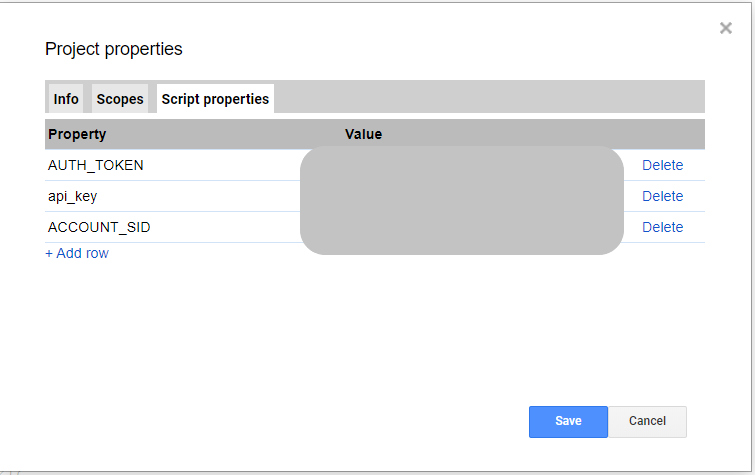

# Daily Stock Activity Reminder

## What and why?

This script sends daily SMS about the activity of any US stock symbol available in Alpha Vantage API. I used TWLO as an example. It can be useful to track a symbol's activity if you are holding any or intend to buy one. 

### Things needed to use this script
1. Alpha Vantage API Key which you can get from [here](https://www.alphavantage.co/support/#api-key) for free
2. Twilio Account SID, Auth Token and Twilio Phone. You can get these from [here](https://www.twilio.com/console/sms/dashboard). You can create free account at Twilio and get a free Twilio number as well
3. G suite account

### How to use this script?
1. Copy paste this code in [google apps script editor](https://script.google.com/home)
2. Within the editor, navigate to File > Project Properties > Script propeties
3. Paste in your Alpha Vantage API key. Paste your Twilio Account SID and Auth Token and click save as shown in the screenshot
4. Click on the clock button at Google Apps Script editor and add daily Time Driven Trigger based on your timezone

That's it! You will get SMS everyday at your time of choice.
